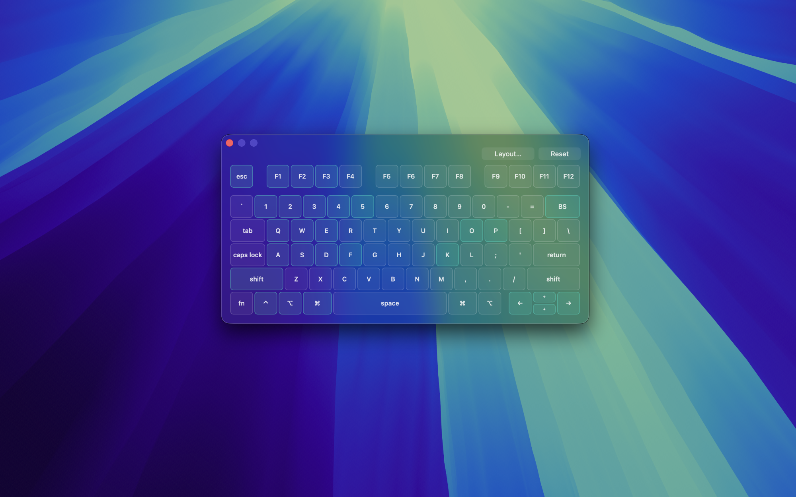
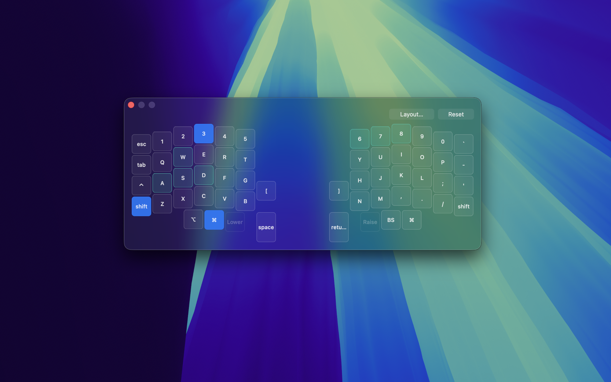

<p align="center">
  <a href="README.md">English</a> | 日本語
</p>

<p align="center">
  
</p>

<h1 align="center">KeyProbe</h1>

<p align="center">
  Raycast から呼び出せるキーボード導通確認ツール。
  <br />
  押したキーをネイティブの半透明パネルで可視化し、リマップ済み・自作キーボードが OS レベルで正しく動作しているか確認できる。
</p>



## 機能

- キーを押している間はハイライトし、離すと「テスト済み」色に変わって残る。まだ押していないキーが一目で分かる
- ANSI / JIS / ISO の標準レイアウトを内蔵。接続中のキーボードのハードウェア種別から自動判定
- Corne、Lily58、Planck、HHKB、Keychron Q11、moNa2、Kinesis Advantage 360 など、50種類以上のカスタムキーボードレイアウトを同梱。**Select Keyboard Layout** から検索して選択可能
- OS固有のキーコードを持たないキー（レイヤーキー、メディアキーなど）は「テスト不可」として表示され、壊れているキーと見分けがつく
- Reset ボタンでパネルを閉じずに全キーの状態をクリアできる

## セットアップ

1. Raycast から **Open KeyProbe** を実行
2. 権限を求められたら **入力監視 (Input Monitoring)** を許可し、もう一度コマンドを実行

> [!IMPORTANT]
> 初回起動には **入力監視 (Input Monitoring)** 権限が必要（アクセシビリティではない）。システム設定 → プライバシーとセキュリティ → 入力監視 で `KeyProbeHelper` を有効にしてから、もう一度 **Open KeyProbe** を実行すること。これを許可しないと、パネルは開くがキーを押しても何も反応しない。

## レイアウトの選択

<p align="center">
  
  
</p>

- Raycast の Preferences にある **Keyboard Layout** で、デフォルトのレイアウト（Auto-detect / ANSI / JIS / ISO）を設定できる
- **Select Keyboard Layout** コマンドでは、同梱の全レイアウト（カスタムキーボード含む）を検索して選択できる。パネルを開いたままでも即座に切り替わる

> [!NOTE]
> Auto-detect は接続されている**キーボードのハードウェア種別**を見て判定しており、macOSの入力ソース（言語設定）とは無関係。ANSI形状のキーボードは、ファームウェアがJISマップのキーコンボを送信してきても「ANSI」のまま扱われる。そうしたキーを検証したいときは明示的にJISを選ぶこと。

## 既知の制約

> [!WARNING]
> 輝度・音量などのハードウェアメディアキーは、このツールが捕捉できない別種のイベントとして送られてくるため、まったく反応しない（「レイアウト外キー」としても表示されない）。

- 一部のJIS/ISO配列の記号キーは実機で未検証のベストエフォートな割り当て（詳細は `assets/layouts/jis.json` / `iso.json` 内のコメント参照）
- cornixはデフォルトキーマップがマクロ多用で自動解析できなかったため、実際のデフォルトキーマップの画像を参考にレイアウトを作成した。4つのレイヤー切り替えキーと、Mute・マウスボタン1つだけは「テスト不可」表示になっている — それ以外は実際のデフォルトキーマップ通り

## 自作キーボードのレイアウトを追加する

同梱されているボードは、`tools/` 以下のスクリプトでQMK/ZMKファームウェアのソースから変換している:

```bash
# QMKボード（keyboard.json/info.json + keymap.c または keymap.json）
python3 tools/qmk_to_layout.py \
  --keyboard-json <qmk_firmware>/keyboards/<board>/keyboard.json \
  --keymap <qmk_firmware>/keyboards/<board>/keymaps/default/keymap.json \
  --name "My Board" --out assets/layouts/myboard.json

# ZMKボード（物理レイアウトJSON + .keymap DTSファイル）
python3 tools/zmk_to_layout.py \
  --geometry <zmk-config>/config/myboard.json --layout-name default_layout \
  --keymap <zmk-config>/config/myboard.keymap \
  --name "My Board" --out assets/layouts/myboard.json
```

生成されたJSONを `assets/layouts/` に置くだけで、コード変更なしに検索UIから選べるようになる。各スクリプトは `--help` で全オプションを確認できる。
